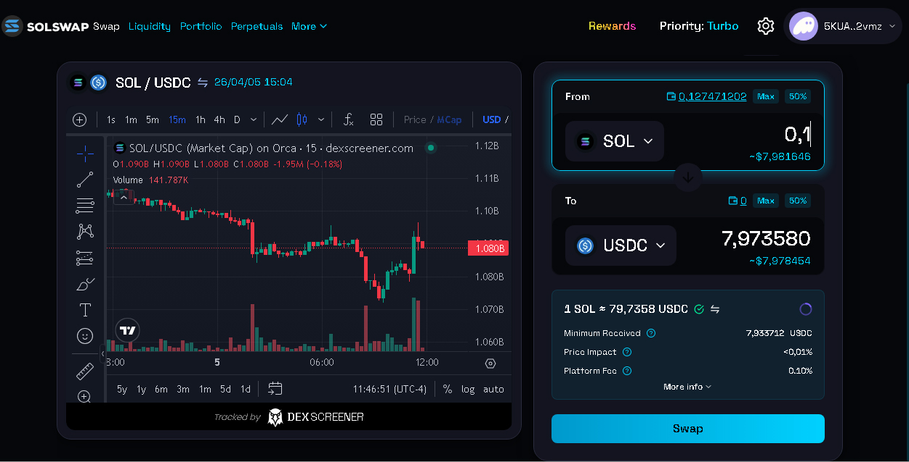
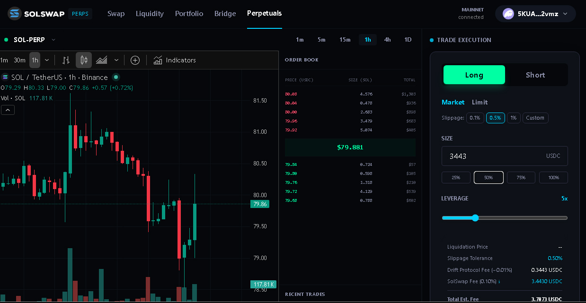
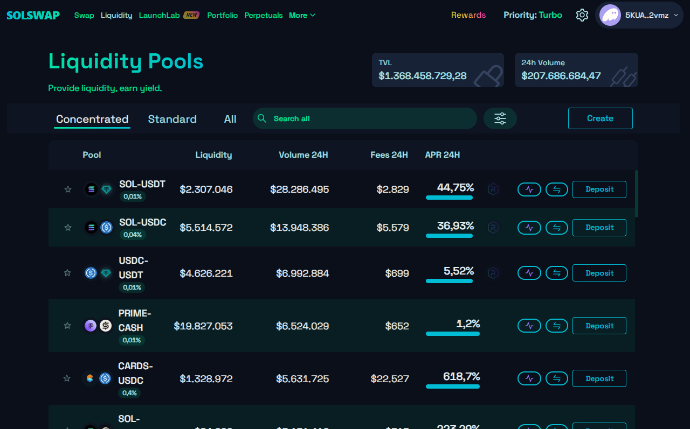
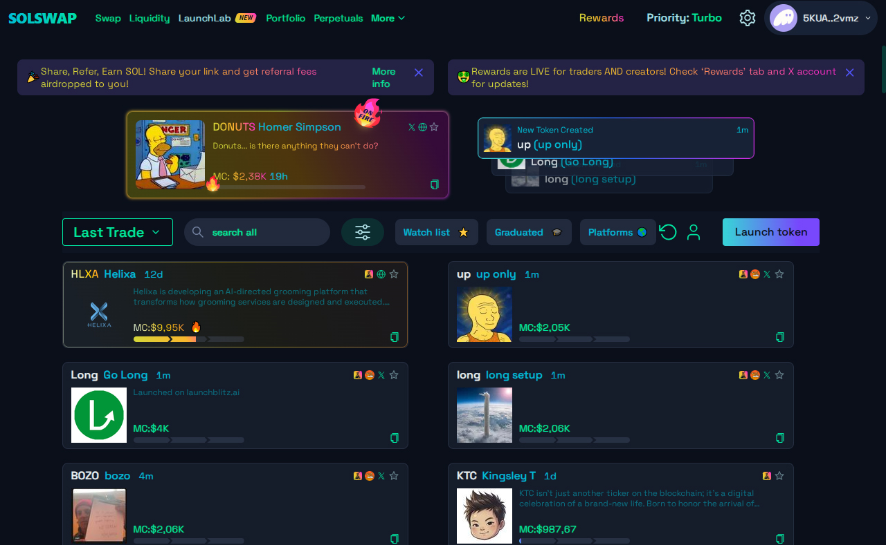
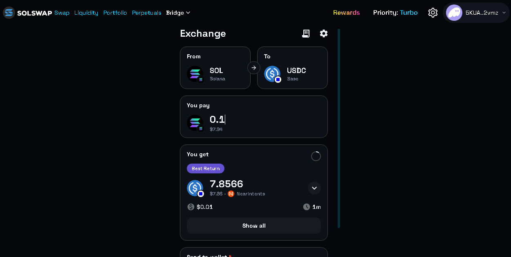

# SolSwap DEX

> Fast, permissionless token swap on Solana — powered by Raydium liquidity


**Live:** [solswap.cloud](https://www.solswap.cloud)



---

## What is SolSwap?

SolSwap is a decentralized exchange (DEX) built on Solana, forked from Raydium UI v3
and rebranded with custom integrations replacing all proprietary dependencies
with free, open alternatives.

---

## Advanced Transaction Architecture

SolSwap features a **CEX-lite Orchestration Layer** designed for maximum resilience under high network congestion and RPC instability.

### 🛡️ Resilience Pillars
- **Idempotency Layer**: Every swap generates a unique `swapSessionId`, preventing duplicate executions even in cases of double-clicks or UI re-renders.
- **Transaction Queue (FIFO)**: Serialized swap execution with backpressure control (`maxConcurrency=1`) to prevent wallet collisions and RPC 429 throttling.
- **Circuit Breaker RPC Failover**: A performance-weighted failover pool that dynamically rotates between endpoints based on latency, success rates, and health states (`healthy` → `degraded` → `cooldown`).
- **Dual-Plane Finality Tracker**: 
  - **Execution Plane**: Fast confirmation (60s timeout) with graceful unknown state handling.
  - **Observability Plane**: Async background workers poll until `finalized`, with exponential backoff and normalized drift detection.
- **Crash Recovery**: Persistent tracking state via **IndexedDB** allows the system to auto-resume finality monitoring even after a browser crash or page refresh.
- **Global Event Log (Audit)**: An append-only local log in IndexedDB that records every orchestration event (e.g., `RPC_CIRCUIT_OPEN`, `DRIFT_DETECTED`, `TX_INIT`) for post-mortem analysis.

### ⚡ Performance & Synchronization
- **Multi-Tab Leadership Election**: Uses the **Web Locks API** to ensure only one browser tab actively polls the RPC for a specific transaction, preventing redundant calls.
- **Cross-Session State Sync**: Real-time IPC via **BroadcastChannel** keeps the UI in sync across all open SolSwap tabs.
- **MEV Intelligence**: A heuristic `MevProtector` analyzes swap value and slippage to detect sandwich risks, suggesting dynamic priority fees or injecting **Jito Tips** for guaranteed ordering.
- **Probabilistic Finality**: Instead of binary states, the system calculates a real-time finality confidence score (0-100%) based on cluster slot depth relative to the confirmation slot.

---

## Key Integrations

| Feature | Provider |
|---|---|
| Charts | lightweight-charts + GeckoTerminal OHLCV |
| Token list | Jupiter Token List |
| Price data | Jupiter Price API + BirdEye |
| Cross-chain | Li.Fi |
| RPC | Helius (Primary) + Circuit Breaker Failover |
| Error tracking | GlitchTip |
| Persistence | IndexedDB (Transaction Recovery) |

---

## Feature Previews

### Perpetuals Trading


### Liquidity Pools


### LaunchLab (Launchpad)


### Cross-Chain Bridge


---

## Revenue Model

- Platform fee: 0.10% per swap (configurable via `FEE_BPS`)
- Jupiter referral: 1% to fee wallet
- Fee wallet: [View on Solscan](https://solscan.io/account/5KUA4a4qFusTvJeSquKsBSEPvhiVedvaj8hE8pVp2vmz)

---

## Self-Host in 5 Minutes
```bash
git clone https://github.com/Solswap-DEX/solswap-ui
cd solswap-ui
cp .env.example .env.local
# Fill in your API keys in .env.local
npm install
npm run dev
```

---

## Rollback Plan

### Full rollback (if deploy breaks the site):
```bash
git revert HEAD
git push origin main
# GitHub Actions will auto-deploy the reverted version
```

### Quick fee disable (if platformFee causes swap failures):
1. Go to Settings → Secrets → Actions
2. Set `FEE_BPS` → `0`
3. Push any change to main to trigger redeploy

---

## Project Structure
```
src/
├── component/    # Reusable pure components
├── config/       # Chain and wallet settings
├── features/     # Domain modules (Swap, Farm, Pool…)
│   └── Swap/
│       ├── useSwapStore.ts          # Main store & orchestration
│       ├── txQueueManager.ts        # FIFO Queue & RPC Failover
│       ├── reconciliationWorker.ts   # Async Finality & Persistence
│       └── ...
├── hooks/        # Shared hooks
├── pages/        # Next.js entry points
├── store/        # Shared Zustand stores
├── provider/     # Global providers
└── util/         # Shared utilities
```

License
Apache 2.0 — fork freely.
